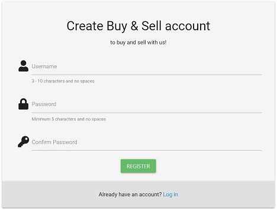

# Milestone Project 3

---

## Buy & Sell Marketplace

This project is a summary of study from the eight, ninth and tenth modules of the Full Stack Developer Course - Python Fundamentals, Practical Python and Data Centric Development, to create a fully Mobile Responsive CRUD Web Application.

Buy & Sell app is an online marketplace where users can buy and sell items. Purpose of this project is to create simple app where users can add new ads, browse and search for items and update or delete ads they added.

## Table of contents

- <a href="#project">Project Construction 👷</a>
- <a href="#ux">User Experience Design 🧠</a>
    - <a href="#us">User Stories</a>
    - <a href="#us">Design</a>
- <a href="#tech">Technologies Used 🔨</a>
  - <a href="#lang">Languages</a>
  - <a href="#flp">Frameworks, Libraries & Programs</a>
- <a href="#features">Features List 😲</a>
  - <a href="#existing">Existing Features</a>
  - <a href="#future">Future Features</a>
- <a href="#testing">Testing 🔥</a>
  - <a href="#manualtesting">Manual Testing</a>
  - <a href="#ustesting">User Stories</a>
  - <a href="#bugs">Bugs</a>
- <a href="#deployment">Deployment 🚀</a>
- <a href="#credits">Credits 🙏</a>
  - <a href="#code">Code</a>
  - <a href="#media">Media</a>
  - <a href="#ack">Acknowledgments</a>

## 1️⃣ Project Construction 👷

This application contains the key CRUD requirement functionality and utilises a data handling document based database, MongoDB. Functionality is created using Flask, HTML5, CSS and JavaScript. Materialize framework was used in building fronted structure to make sure app is responsive as possible and can be used on multiple screen sizes.

Application offer a registration and login system with password hashing to protect each user. Logged user can browse ads created by other registered users and create, update and delete ads created by him.

Un-registered users can also use the application, but their permissions are limited to viewing ads created by registered users only.

<a href="#top">Back to top ⬆️</a>

## 2️⃣ User Experience Design 🧠

### User stories:

#### Guest (un-registered) User:

1. As a Guest user, I want to browse the ads added by registered users.
- All users can browse ads by selecting ad category or by search option on welcome page.
2. As a Guest user, I want to be able to see seller contact details or add my ads.
- For more permissions Guest can register using quick registration form and then login .
3. As a Guest user, I want app to be visually appealing and easy in use.
- Application is very intuitive to use and has clear layout.
4. As a Guest user,  I want to contact someone in the event something is wrong with the app.
- Contact information can be found in footer.

#### Registered User:

1. As a Registered User, I want to 'Log in' to my profile.
- Registered User can 'Log in' using registered username and password.
2. As a Registered User, I want to add my ads.
- Registered User can start adding ad by clicking 'Place Ad' button in navigation bar.
3. As a Registered User, I want to Edit or Delete my ads.
- Edit and Delete buttons are placed in ad view page and are visible for advertiser.
4. As a Registered user, I want 'Profile' page where I can see my all ads.
-  Registered user will see 'Profile' tab in navigation after Log In.
5. As a Registered user, I want report ad when item is suspicious or not appropriate.
- Registered used can use 'Report Ad' button under ad on ad view page.
5. As a Registered user, I want to 'Log out'.
- 'Log out' button is located on navbar.

#### Moderators

1. As Moderator, I want Registered user functionality.
- Mod has Registered User functionality.
2. As Moderator I want to Edit or Delete any ad.
- Moderator can see Edit and Delete buttons for all ads on ad view page.
2. As Moderator, I want to see ad reports.
- Moderator can see all reports in table under ad.
3. As Moderator, I want to delete reports.
- Moderator can delete reports using Delete button.

#### Admin:
1. As Admin, I want Registered User and Moderator functionality.
- Admin has Registered User and Mod functionality.
2. As Admin, I want to ad new 'Categories'
- Admin has dedicated page where he can click 'Add Category' button.
3. As, Admin I want to remove 'Registered User'.
- Admin has dedicated page where he can delete any user.
5. As Admin I want to edit users permissions.
- Admin has dedicated page where he can update status for users.

#### Developer:

1. As a Developer, I want to create database application app using Python and Flask.
- Application functionality is created thanks to use Flask and Python.
2. As a developer, I want to create fully responsive app.
- Application is fully responsive thanks to Materialize framework.

### Design:

#### Color Scheme:

The assumption for the application was simple: must look professional so the color selection is the key.
- Main colors are:

#### Typography:

The "Roboto" font is the main font used throughout the whole website with Sans Serif as the fall back font in case the font isn't imported into the site correctly.
Roboto offers a pleasing reading ability to the user and is easy on the eyes. Font is  clean, professional and very readable amongst all major languages.

#### Content Structure:

The application is primarily rectangular shaped with by default subtle rounded edges around buttons to create a nice flow for the user. Content is grouped in sections, an example of this would be the Home page:
- The main body of the page is horizontally separated into sections, we have a search section where user can find ads by text, category section where user can choose ads by their category, and finally we have a recent added ads section where user can see 8 last added ads. Page is finished by footer  where we can find short site description, email address and social links.

Despite the large amount of content, the user is not overwhelmed, thanks to simple but effective layout.

#### Wireframes:

- <a href="static/readmeimages/desktop-wireframes.pdf" target="_blank">Desktop wireframes</a>
- <a href="static/readmeimages/mobile-wireframes.pdf" target="_blank">Mobile wireframes</a>

Update:

The first raw design wos drawn on a piece of paper and then the idea was transferred to an advanced creator. However, while creating application changes were made to improve the appearance and functionality.

- Footer has been completely redesigned. The explore links have been removed, social media has been limited to icons, about info has been added so that the user can familiarize with website assumptions. All info has been placed vertically on all screen sizes.
- Login and registration pages has been split into two separate pages.
- On admin site tables with all categories, all users and reported ads have been added.

<a href="#top">Back to top ⬆️</a>

## 3️⃣ Technologies Used 🔨

### database

- <a href="https://www.mongodb.com/" rel="noopener" target="_blank">mongoDB</a> -general purpose, document-based, distributed database built for modern application developers and for the cloud era.

Schema:

### Languages Used:

- <a href="https://en.wikipedia.org/wiki/HTML" rel="noopener" target="_blank">HTML</a> - Standard mark-up language for documents designed to be displayed in a web browser.
- <a href="https://en.wikipedia.org/wiki/CSS" rel="noopener" target="_blank">CSS</a> - Describes how HTML elements are to be displayed on screen, paper, or in other media.
- <a href="https://en.wikipedia.org/wiki/JavaScript" rel="noopener" target="_blank">JavaScript</a> - Programming language that conforms to the ECMAScript specification.
- <a href="https://en.wikipedia.org/wiki/Python_(programming_language)" rel="noopener" target="_blank">Python</a> - Interpreted, high-level and general-purpose programming language

### Frameworks, Libraries & Programs Used:

- <a href="hhttps://www.heroku.com/ttps://materializecss.com/" rel="noopener" target="_blank">Materialize</a> - A modern responsive front-end framework based on Material Design
- <a href="https://jquery.com/" rel="noopener" target="_blank">jQuery</a> - Fast, small, and feature-rich JavaScript library.
- <a href="https://git-scm.com/" rel="noopener" target="_blank">Git</a> - Free and open source distributed version control system.
- <a href="https://github.com/" rel="noopener" target="_blank">GitHub</a> - A Git repository hosting service.
- <a href="https://www.heroku.com/" rel="noopener" target="_blank">Heroku</a> - A cloud platform as a service supporting several programming languages.
- <a href="https://www.mongodb.com/" rel="noopener" target="_blank">mongoDB</a> -general purpose, document-based, distributed database built for modern application developers and for the cloud era.
- <a href="https://fontawesome.com/" rel="noopener" target="_blank">Font Awesome</a> - A web font containing all the icons from the Twitter Bootstrap framework, and now many more.
- <a href="https://fonts.google.com/" rel="noopener" target="_blank">Google Fonts</a> - A library of 999 free licensed font families.
- <a href="balsamiq.com" rel="noopener" target="_blank">Balsamiq</a> - Wireframing tool.

<a href="#top">Back to top ⬆️</a>

## 4️⃣ Features List 😲

### Existing features:

This application has different features for different users. User status determines what kind of functions a given user has:
- Guest - unregistered / not logged in user with minimum permissions.
- User - registered in database and logged in to application.
- Moderator - User with higher level of permissions. The moderator ensures that the content of the website is in accordance with the rules and the law.
- Admin has the highest level of permissions.

#### Create features:

Guest:

Guest can create new User in database thanks to registration form and then log in to app. Guest can see PLACE AD button but click will redirected to Log in page.

- To register Guest has to click 'Register' link located on navbar.
     

    
- Registration page will show up, Guest can choose username and password.

- After successfully registration, Guest will be able to log in to app using details provided on registration.

User / Moderator:

Logged in Users or Moderators can create new ads.

- To place new ad User has to click PLACE AD button that is located on navbar.

- Place ad form will show up. 

Admin:

Admin has logged in user and moderator functionality and also can create new categories.

- To create new category admin has to click CONTROL PANEL button that is visible only for him.

- On Control Panel page in Manage Category section admin has to click ADD CATEGORY button.

- Add category form will show up.

#### Read features:

All users can navigate thru app and see ads in all categories.

However Guest has no permission to see Users Profiles or contact information. This restriction was put in place to encourage Guest to registration.

#### Update features:

User / Moderator:

User can edit ads he created. Moderator can edit any ad.

- To update ad User / Mod has to navigate to ad view page and click yellow edit button.

- Edit ad page will show up with fields that contain ad details. 

Admin:

Admin has User and Moderator functionality and also can edit categories and update user status.

- To edit category admin has to click CONTROL PANEL button thats located on navbar and is visible only for him.

- On Control Panel page in Manage Category section admin has to click yellow EDIT button.

- Edit category page will show up.

- To update User status admin has to click CONTROL PANEL button thats located on navbar and is visible only for him.

- On Control Panel page in Manage Users section Admin has to click yellow EDIT button.

- Update user status form will show up and from dropdown menu admin can select new status.

#### Delete features:

User / Moderator:

User can delete ads he created. Moderator can delete any ad.

- To delete ad User / Mod has to navigate to ad view page by clicking on ad preview.

- Then on ad view page User has to click red Delete button.

Admin:

Admin has User and Moderator functionality and also can delete categories and users.

- To delete category, admin has to click CONTROL PANEL button thats located on navbar and is visible only for him.

- On Control Panel page in Manage Category Section admin has to click red Delete button.

- To delete User, admin has to click CONTROL PANEL button thats located on navbar and is visible only for him.

- On Control Panel page in Manage Users section Admin has to click red Delete button beside user he wants to delete.
This action will also delete user ads.

#### Search features:

All users can search for ads by text. It will find ads if search phrase will be detected in ad title or description. The search is not case sensitive. Users can use search form in all ads or in particular category.

All users:

- To search in all ads visitor can use search form on main page, which will redirect user to all ads.

- To search in particular category visitor can use in category search form

#### Report ad

This option is created for users to report to moderators and administrators the content that, according to them, violates the rules of the website. When the ad is reported, Mod and Admin will be able to see the report log in the table that will show up on the bottom of ad view.
Reported ad will also show up in Admins Manage Reported ad section in control panel. Moderator and admin can read reports and take appropriate action.

User:

- Report ad option is located on the bottom of view ad page.

- After clicking, modal form with text area will show up.

Admin / Moderator:

- To see if there are reported ads, Admin has to click CONTROL PANEL button thats located on navbar and is visible only for him.

- Scroll down on Control Panel page and check Reported Ad section

- Click on ad title will redirect Admin to ad view page. Report log table will be located on the bottom of the page.

### Future features:

**Sort:**  I would lke to implement sort option that will sort ads by category, price, date added.

**Watch ad:** I would like to implement this feature to save ads created by others so user can have quick access to this ads.

**Message system:** I would like to implement internal message system where users can message to each other.

**Feedback:** I would like to implement feedback system so the users can score each other, depends how the transaction went.

<a href="#top">Back to top ⬆️</a>

## 5️⃣ Testing 🔥

### Manual Testing:

Testing and improving the application was carried out throughout its development. The main testing tool was Google Chrome dev tools and devices such as phone, tablet and laptop with several versions of browsers (Google Chrome, Firefox, Edge, Opera).

Materialize framework was tested extensively to ensure that the Mobile first Responsive Approach was achieved with this project. The Application was tested on my Lenovo Thinkbook laptop and large Samsung TV screen, Samsung Galaxy S6 mobile and Lenovo tablet. The application worked fine on all devices. If something didn't work as it should during the test it was immediately checked and corrected in DevTools and then implemented into the code and checked again. If test passed it was committed and pushed into repository.

Python based code was checked and tested using PEP8 online validator and finished without any errors.

JavaScript and jQuery were tested using JS Hint and finished without errors.

CSS was validated using W3C's Jigsaw Validator and finished without errors.

Passing the HTML file content through the W3C Validator for HTML resulted in numerous errors triggered by Jinja's framework embedded within the document. The standard HTML is W3C compliant, no other errors found.

 ### User Stories:

 #### Guest user:

 Here are the steps and results from the testing carried based on the project user stories to determine that the app and functionality are fit for purpose:
1. As a Guest user, I want to browse the ads added by registered users.
- Open <a href="https://buy-and-sell-project.herokuapp.com/">Buy & Sale</a>
- To browse ads by category:
    - Click on one of the categories in category section.
    - On category page browse ads added by registered users.
    - Browse ads displayed in Recently Added Ads section 
- To browse recently added ads:
    - Locate 'Recently added ads' section and browse ads.
- To browse all ads:
    - Locate 'Recently added ads' section.
    - Click 'see all'
    - New page will display all ads.

Result: Everything works as it should, all ads are displayed in correct places. Page nav helping to determinate currently location.

2. As a Guest user, I want to be able to see seller contact details or add my ads.
- On any page in application click 'Register' tab located on navbar.
- Fill up registration form and click register button.
- After redirection to login page fill up login form using registered details.
- After login, view ads without restrictions and add your ads.

Result: Registration works as it should. Username and password requirements are displayed on form and if they are missed form will not be submitted.
If client validation is correct, form is checked on back end side to make sure username is not already in database. User is informed about every situation by flash messages.
Login is secured on back end side to make sure user will match username with password. Flash messages works as they should.

3. As a Guest user, I want app to be visually appealing and easy in use.
- Open <a href="https://buy-and-sell-project.herokuapp.com/">Buy & Sale</a>
- Click on one of the categories in category section.
- Click one of the ads.
- On the 'ad view' page locate page navigation and click on Home
- Locate 'Recently added ads' section and click one of the ads.
- On the 'ad view' page locate page navigation and click on Category.
- On the 'category' page click on Buy&Sell logo located on navbar.

Result: Using application is very easy. You can always locate yourself thanks to intelligent page navigation. Colors 'catch' user eyes and page layout is very friendly for user.

4. As a Guest user, I want to contact someone in the event something is wrong with the app.
- On any page in application scroll down to footer.
- Footer provides email contact information and redirection to most popular social media.

Result: Information display works as it should. User can't miss footer with logo and ways of contact. Email and social media are currently the fastest ways to contact any company.

 

 ### Bugs:

 ??????????????????????????????????????????????????????

 

<a href="#top">Back to top ⬆️</a>

 
 

## 6️⃣ Deployment 🚀

This project was developed in GitPod. All developments were pushed to the corresponding repository in GitHub account. App was deployed in Heroku.

In order to deploy the website to Heroku:

- I ensured that app.py, requirements.txt and Procfile files are created and pushed to GitHub.  

- I Created new account on Heroku and I set up new application.

- In 'Deploy' tab I set 'Deployment method' to 'GitHub' so Heroku is automatically updated with GitHub.

- In 'App connected to Github' I set my Github nick and matching repository and clicked 'Connect' button.

- In 'Settings' tab I set 'Config Vars' to match those in app.py file.

- In 'Deploy' tab I clicked "Enable Automatic Deploys".

- To see my deployed app I clicked 'Open App' on the top of Heroku page.

### Run this project locally:

- Select the Repository from the GitHub Dashboard.

- Click the green button labelled 'Code'.

- Click 'Download ZIP'.

- Extract ZIP file on your computer.

- Open folder and open index.html in web browser.

### Clone this project:

- Select the Repository from the GitHub Dashboard.

- Click the green button labelled 'Code'.

- To clone the repository using:
    - HTTPS: under "Clone with HTTPS", click checklist icon.
    - SSH: click Use SSH, then click checklist icon.

- Open Git Bash.

- Change the current working directory to the location where you want the cloned directory.

- Type 'git clone', and then paste the URL you copied earlier.

- Press Enter to create your local clone.

<a href="#top">Back to top ⬆️</a>

## 7️⃣ Credits 🙏

### Code:

- <a href="https://materializecss.com//">Materialize</a> library mainly to make site responsive and implement simple style for margins, padding and elements alignment.
- <a href="https://www.youtube.com/watch?v=DsgAuceHha4&ab_channel=PrettyPrinted">Save and Retrieve Files In a MongoDB With Flask-Pymongo</a> I used this tutorial to learn how to store and retrieve images from mongoDB.

### Media:

Ads images:
- Playstation 2 - Photo by <a href="https://unsplash.com/@dmjdenise?utm_source=unsplash&utm_medium=referral&utm_content=creditCopyText">Denise Jans</a> on <a href="/s/photos/playstation-3?utm_source=unsplash&utm_medium=referral&utm_content=creditCopyText">Unsplash</a>
- Samsung Galaxy S10 - Photo by <a href="https://unsplash.com/@emilianocicero?utm_source=unsplash&utm_medium=referral&utm_content=creditCopyText">Emiliano Cicero</a> on <a href="/s/photos/samsung-galaxy?utm_source=unsplash&utm_medium=referral&utm_content=creditCopyText">Unsplash</a>
- Audi r8 - Photo by <a href="https://unsplash.com/@taiscaptures?utm_source=unsplash&utm_medium=referral&utm_content=creditCopyText">Tai's Captures</a> on <a href="/?utm_source=unsplash&utm_medium=referral&utm_content=creditCopyText">Unsplash</a>
- Jeep - Photo by <a href="https://unsplash.com/@orca23?utm_source=unsplash&utm_medium=referral&utm_content=creditCopyText">Dan Gomer</a> on <a href="/s/photos/jeep?utm_source=unsplash&utm_medium=referral&utm_content=creditCopyText">Unsplash</a>
- Jacket - Photo by <a href="https://unsplash.com/@orca23?utm_source=unsplash&utm_medium=referral&utm_content=creditCopyText">Dan Gomer</a> on <a href="/s/photos/jeep?utm_source=unsplash&utm_medium=referral&utm_content=creditCopyText">Unsplash</a>
- Shoes - Photo by <a href="https://unsplash.com/@revolt?utm_source=unsplash&utm_medium=referral&utm_content=creditCopyText">REVOLT</a> on <a href="/s/photos/shoes?utm_source=unsplash&utm_medium=referral&utm_content=creditCopyText">Unsplash</a>
- Brush - Photo by <a href="https://unsplash.com/@switch_dtp_fotografie?utm_source=unsplash&utm_medium=referral&utm_content=creditCopyText">Lucas van Oort</a> on <a href="/s/photos/garden-tool?utm_source=unsplash&utm_medium=referral&utm_content=creditCopyText">Unsplash</a>
- Wheelbarrow - Photo by <a href="https://unsplash.com/@philhearing?utm_source=unsplash&utm_medium=referral&utm_content=creditCopyText">Phil Hearing</a> on <a href="/s/photos/wheelbarrow?utm_source=unsplash&utm_medium=referral&utm_content=creditCopyText">Unsplash</a>
- Chair - Photo by <a href="https://unsplash.com/@itssammoqadam?utm_source=unsplash&utm_medium=referral&utm_content=creditCopyText">Sam Moqadam</a> on <a href="/s/photos/chair?utm_source=unsplash&utm_medium=referral&utm_content=creditCopyText">Unsplash</a>
- Couch - Photo by <a href="https://unsplash.com/@martinpechy?utm_source=unsplash&utm_medium=referral&utm_content=creditCopyText">Martin Péchy</a> on <a href="/s/photos/couch?utm_source=unsplash&utm_medium=referral&utm_content=creditCopyText">Unsplash</a>
- Bike - Photo by <a href="https://unsplash.com/@robertbye?utm_source=unsplash&utm_medium=referral&utm_content=creditCopyText">Robert Bye</a> on <a href="/s/photos/bike?utm_source=unsplash&utm_medium=referral&utm_content=creditCopyText">Unsplash</a>
- Fitness equipment - Photo by <a href="https://unsplash.com/@kellysikkema?utm_source=unsplash&utm_medium=referral&utm_content=creditCopyText">Kelly Sikkema</a> on <a href="/s/photos/weights?utm_source=unsplash&utm_medium=referral&utm_content=creditCopyText">Unsplash</a>
  

### Acknowledgments:

- <a href="https://codeinstitute.net" rel="noopener" target="_blank">Code Institute</a>
- <a href="https://stackoverflow.com/" rel="noopener" target="_blank">Stack Overflow</a>
- Code Institute Slack Community.
- My mentor Guido Cecilio for guidance and support.
- My family and friends for their patience and honest critique throughout.

<a href="#top">Back to top ⬆️</a>

